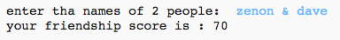
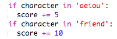
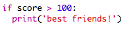
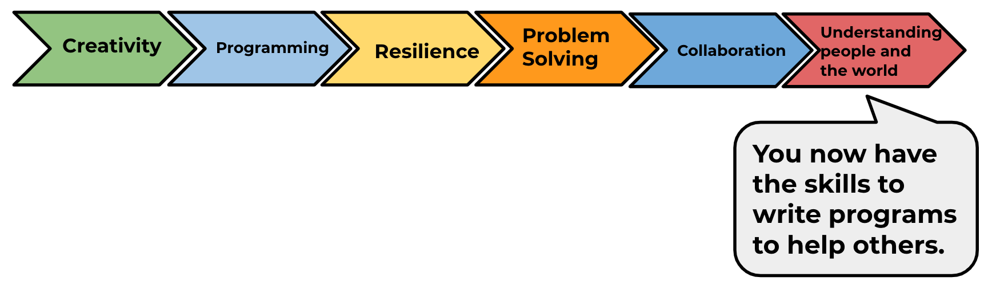

--- challenge ---
## Challenge: Friendship calculator
Write a program to show how compatible 2 people are, by calculating a friendship score.

The program could loop through each of the characters in the 2 names, and add points to a `score` variable each time certain letters are found.

You should decide on rules for awarding points. For example, you could award points for vowels, or characters that are found in the word "friend":

You could also give the user a personalised message, based on their score:

If you want to create interactive games using the micro:bit try out 'Interactive badge', the first project in the micro:bit module. There’s also plenty of other modules to try!

--- /challenge ---

Click on the 'Click me' button to try the next project:

<a href="https://codeclub.org/en/projects-cc">

